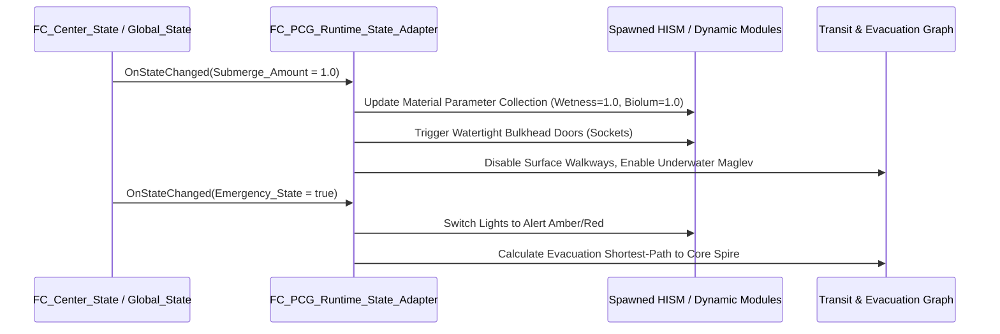

# 04.02 - PCG Runtime State Adapter & Event Binding

## Purpose
สถาปัตยกรรมตัวเชื่อม (Adapter Pattern) ทำหน้าที่รับ Event การเปลี่ยน State จากเกมเพลย์หรือ State Machine เดิม (`FC_Flower_State`, `FC_Center_State`) แล้วส่งคำสั่งไปอัปเดตชิ้นส่วนที่ถูก PCG สร้างขึ้นมาแล้ว โดย **ไม่ต้อง Regenerate โลกใหม่**

---

## Architecture Flow

---

## Adapter Handlers

### 1. Water Submersion Handler (`HandleSubmergeAmount`)
- ค้นหาทุกโมดูลที่มีพิกัด $Z < 	ext{CurrentWaterLevel}$
- เปลี่ยน Material Scalar Parameter:
  - `Wetness_Intensity`: $0.0 dots 1.0$
  - `Sea_Depth_Darkness`: ปรับความมืดตามค่า Z
  - `Bioluminescent_Glow`: เปิดไฟส่องสว่างใต้ทะเล
- ปิดประตูผนึกแรงดัน (`Watertight Bulkhead Doors`) ที่ Socket ประเภท `Transit_Pedestrian`

### 2. Emergency Mode Handler (`HandleEmergencyState`)
- สั่งปิดผนึกบานพับและข้อต่อเชื่อมต่อรอบนอก (`Outer Ring Sockets`)
- ปิดไฟถนนปกติ สลับเข้าสู่ไฟฉุกเฉินความถี่ต่ำ
- อัปเดตกราฟเส้นทางหนีภัย (Evacuation Flow) ให้ AI เดินทางมุ่งหน้าสู่ Core Bunker

### 3. Buoyancy & Mass Feedback Handler (`CalculateTotalBuoyancy`)
- รวบรวมค่า `BuoyancyForce_kN` และ `Mass` ของทุกชิ้นส่วนที่ถูก Spawn
- ส่งผลรวมไปยัง Rigging Physics Controller เพื่อคำนวณอัตราเร่งและมุมเอียงตอนจมน้ำหรือลอยน้ำ
