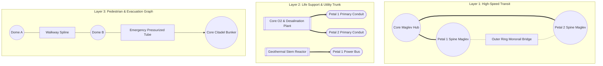
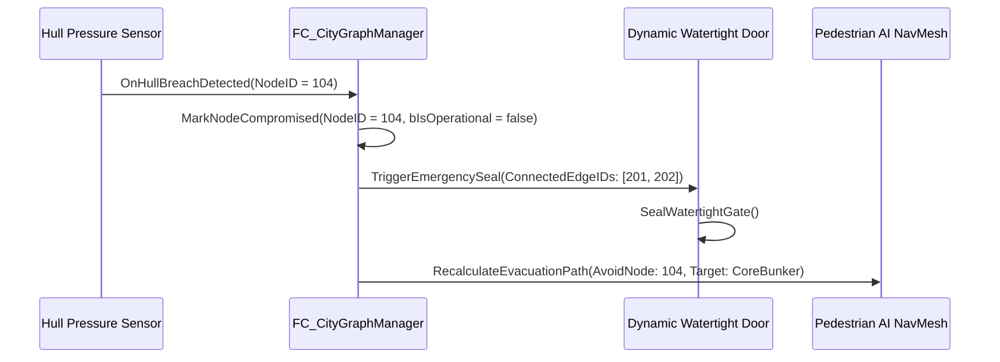

# 03_TRANSIT_AND_RESOURCE_GRAPH - Gameplay & Flow Networks

## Purpose & Overview
ในเกมระดับ Megastructure เมืองไม่ใช่เพียงโมเดล 3D ที่ตั้งอยู่นิ่งๆ แต่ต้องมี **โครงข่ายการสัญจร (Transit Network)** และ **โครงข่ายส่งกำลัง/ทรัพยากร (Resource Flow Grid)** เชื่อมต่อถึงกันทั้งหมด เอกสารนี้ระบุวิธีที่ PCG จะสร้าง Graph Nodes และ Spline Edges ควบคู่ไปกับการวางโมดูล รวมถึงตรรกะการตัดตอนระบบในยามฉุกเฉิน (Disaster Isolation)

---

## 1. ชั้นข้อมูลโครงข่าย 3 เลเยอร์ (Multi-Layer Topological Graph)

---

## 2. กฎการวาง Spline และการเชื่อมต่อ Node ระหว่าง PCG Modules

1. **Spine Spline Generation**:
   * ทุกกลีบเมืองจะมีเส้นกระดูกสันหลังหลัก (Primary Spine Spline) วิ่งตามแนว $v = 0.0$ จากโคนกลีบ ($u = 0.0$) ไปจนถึงปลาย ($u = 1.0$)
   * ราง Maglev และท่อ Utility Trunk หลักจะถูกจัดวางบน Spline เส้นนี้โดยอัตโนมัติ
2. **Socket-to-Socket Local Splines**:
   * เมื่อโมดูล 2 ชิ้นถูกวางเชื่อมต่อกันด้วย Socket ประเภท `Transit_Pedestrian` หรือ `Utility_PowerGrid`
   * PCG Graph จะสร้าง **Spline Component** ขนาดสั้นเชื่อมระหว่างจุดกึ่งกลางของ Socket ทั้งสองทันที พร้อมเติม Mesh ท่อเชื่อมหรือทางเดินแบบยืดหยุ่น (Accordion Bellows)
3. **Inter-Petal Connecting Bridges (สะพานวงแหวนข้ามกลีบ)**:
   * ในรัศมี Ring Tier 2 ($r = 500\text{ m}$) และ Ring Tier 3 ($r = 900\text{ m}$) PCG จะค้นหา Socket ประเภท `Transit_Maglev` ที่ขอบกลีบขวา ($v = +1.0$) และเชื่อมเส้นโค้ง Spline ไปยังขอบกลีบซ้าย ($v = -1.0$) ของกลีบถัดไป

---

## 3. Disaster Isolation & Emergency Routing Logic

เมื่อเกิดเหตุฉุกเฉิน (เช่น โดนโจมตี, น้ำท่วม, หรือโครงสร้างรั่วซึม):

### ตรรกะการตัดตอนระบบ (Isolation Protocols):
1. **Fluid/Oxygen Valve Shutoff**:
   * หาก Edge ใดตรวจพบความดันตกคร่อมผิดปกติ วาล์วตัดตอนที่โคนกลีบ (`Petal Root Junction Valve`) จะปิดทันที เพื่อไม่ให้ออกซิเจนรั่วออกจากแกนกลางเมือง
2. **Power Grid Circuit Breakers**:
   * สถานีไฟฟ้าย่อยประจำกลีบ (`Petal Power Substation`) สามารถตัดการเชื่อมต่อจาก Core Grid และสลับเข้าสู่ Local Battery Storage ภายในกลีบเพื่อรักษาความดันในโดม
3. **Evacuation Routing (Dijkstra Shortest Path)**:
   * ทุก Node มีค่า Weight เริ่มต้นเท่ากับระยะทางจริง (Meters)
   * เมื่อ Node หรือ Edge ใดถูกน้ำท่วม น้ำหนักจะถูกปรับเป็น $\infty$ (Infinite)
   * AI จะค้นหาเส้นทางที่ปลอดภัยที่สุดเพื่อวิ่งหนีเข้าสู่แกนกลางเมือง (Core Spire Citadel)
