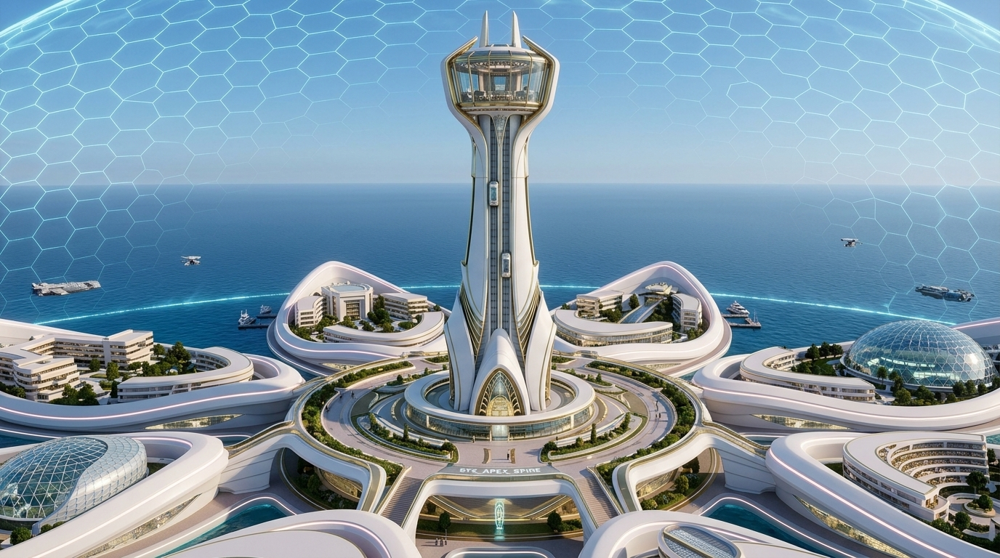
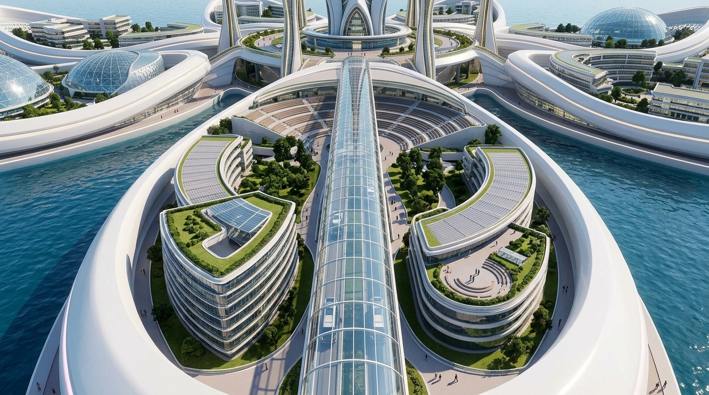
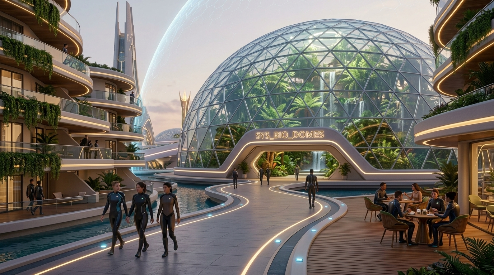
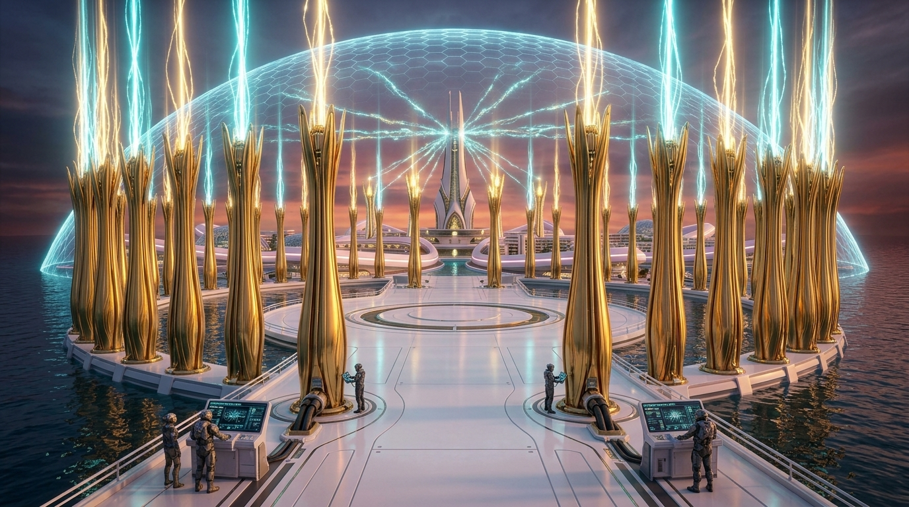
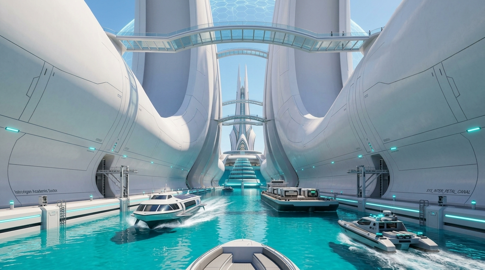
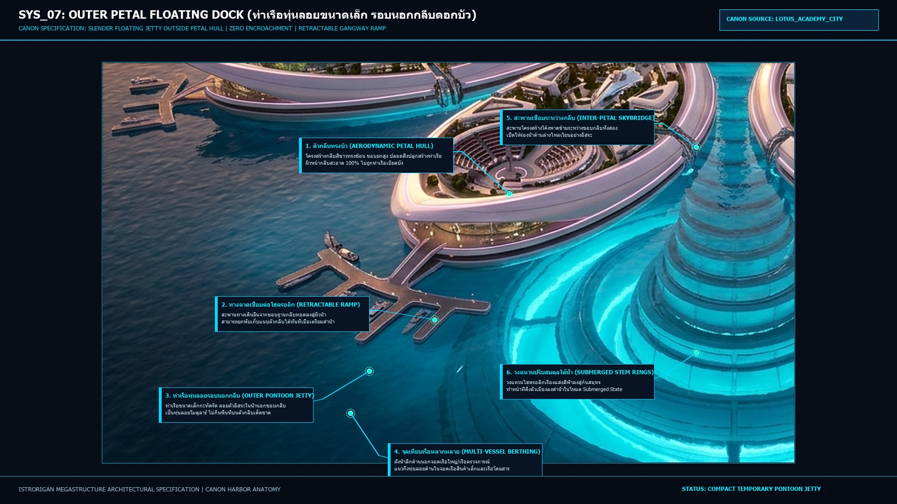
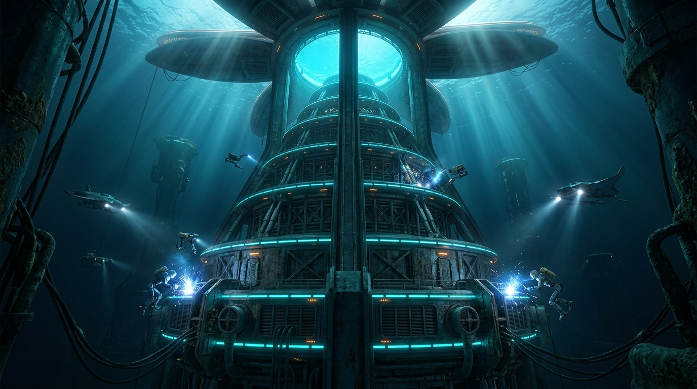
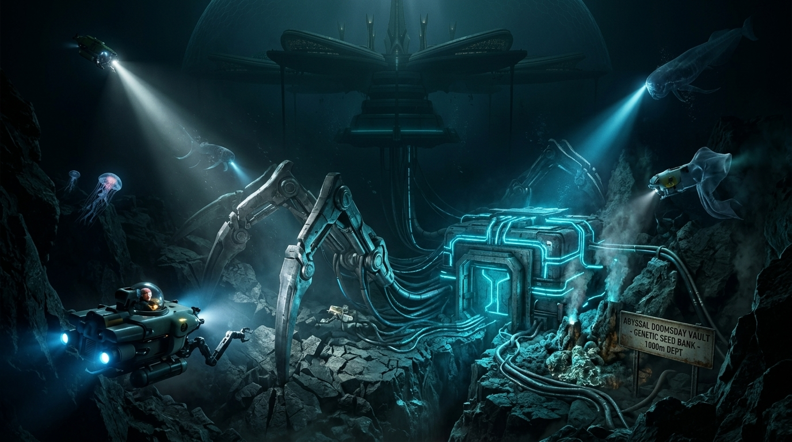
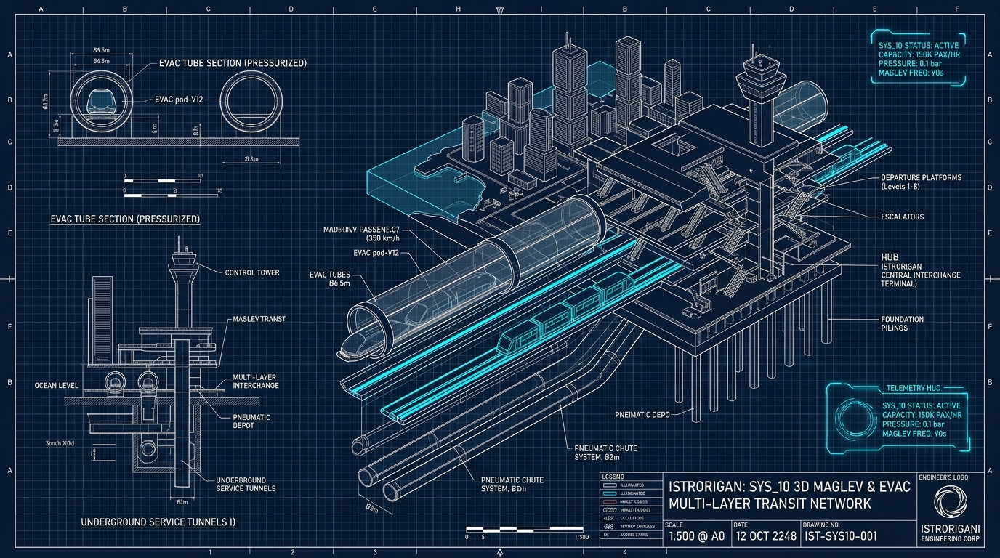
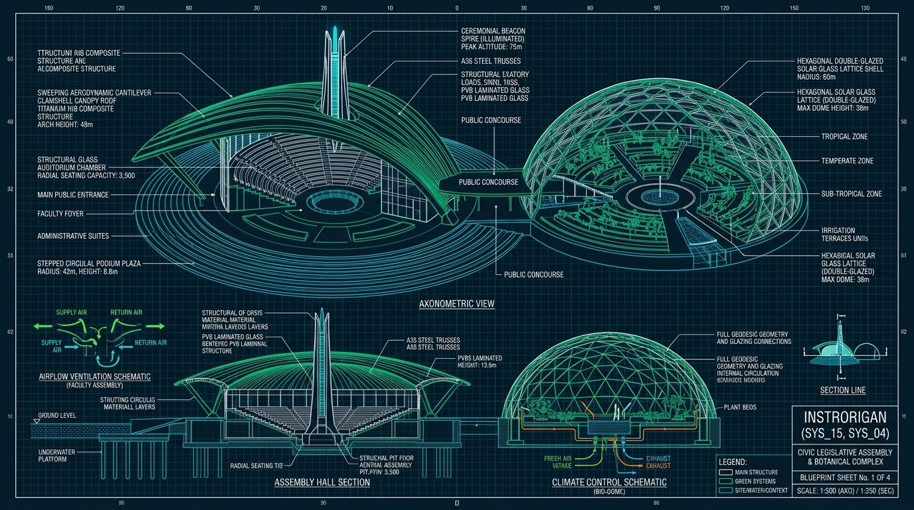

# ISTRORIGAN - ภาพประกอบและผังวิเคราะห์แยกแต่ละส่วนโครงสร้าง (Modular Architecture Visual Breakdown)

> **Era: 4205 | World of 17 Great States**  
> มหานครดอกบัว **ISTRORIGAN (อิสโตรริแกน)** — ศูนย์กลางภูมิปัญญาแห่งเดียวของมนุษยชาติหลังมหาอุทกภัย  
> เอกสารรวบรวมภาพประกอบ Render สถาปัตยกรรมระดับ 8K แบบแยกเดี่ยวของแต่ละส่วนโครงสร้าง พร้อมสเปกทางวิศวกรรม PCG และ Lore ประจำส่วน

---

## สารบัญส่วนประกอบ (System Index)

1. [SYS_01: Apex Spire Citadel (หอคอยสภาสิบ & แกนกลาง)](#1-sys_01-apex-spire-citadel-หอคอยสภาสิบ--แกนกลาง)
2. [SYS_02: Hexagonal Barrier Dome (ม่านบาเรียพลังงานรังผึ้ง)](#2-sys_02-hexagonal-barrier-dome-ม่านบาเรียพลังงานรังผึ้ง)
3. [SYS_03: Academic Petals (วิทยาเขตกลีบดอกไม้ 8 กลีบ)](#3-sys_03-academic-petals-วิทยาเขตกลีบดอกไม้-8-กลีบ)
4. [SYS_04: Bio-Domes & Living Habitats (โดมชีววิจัย & สวนพฤกษศาสตร์)](#4-sys_04-bio-domes--living-habitats-โดมชีววิจัย--หอพักนานาชาติ)
5. [SYS_05: Golden Stamen Pylons (เสาสนามพลังงานสีทอง 70 ต้น)](#5-sys_05-golden-stamen-pylons-เสาสนามพลังงานสีทอง-70-ต้น)
6. [SYS_06: 45m Inter-Petal Canal & Skybridges (ร่องน้ำสัญจรและสะพานลอยฟ้า)](#6-sys_06-45m-inter-petal-canal-ร่องน้ำสัญจรและช่องว่าง-45-เมตร)
7. [SYS_07: Outer Petal Floating Marina Docks (ท่าเรือทุ่นลอยขนาดเล็ก รอบนอกกลีบดอกบัว)](#7-sys_07-outer-petal-floating-dock-ท่าเรือทุ่นลอยขนาดเล็ก-รอบนอกกลีบดอกบัว)
8. [SYS_08: Submerged Telescopic Stem Rings (วงแหวนยืดหด 12 ชั้นใต้น้ำ)](#8-sys_08-submerged-telescopic-stem-rings-วงแหวนยืดหด-12-ชั้นใต้น้ำ)
9. [SYS_09: Abyssal Doomsday Vault & Seabed Claws (คลังความรู้ก้นสมุทร -1,000m)](#9-sys_09-abyssal-doomsday-vault--seabed-claws-คลังความรู้ก้นสมุทร--1000m)
10. [SYS_10: 3D Maglev & Evac Transit Network (โครงข่ายรถไฟแม่เหล็ก & ท่ออพยพด่วน)](#10-sys_10-3d-maglev--evac-transit-network-โครงข่ายรถไฟแม่เหล็ก--ท่ออพยพด่วน)
11. [SYS_11: Core-to-Stem Interface Collar (ปลอกคอรับแรงเฉือนใต้น้ำ 50m)](#11-sys_11-core-to-stem-interface-collar-ปลอกคอรับแรงเฉือนใต้น้ำ-50m)
12. [SYS_12: Inter-Ring Hydraulic Dampers (กระบอกไฮดรอลิกซับแรงคลื่น 176 ชุด)](#12-sys_12-inter-ring-hydraulic-dampers-กระบอกไฮดรอลิกซับแรงคลื่น-176-ชุด)
13. [SYS_13: Vertical Deep-Sea Elevator Core (แกนลิฟต์ดิ่ง 1.1km พร้อมแอร์ล็อก 5 ชั้น)](#13-sys_13-vertical-deep-sea-elevator-core-แกนลิฟต์ดิ่ง-11km-พร้อมแอร์ล็อก-5-ชั้น)
14. [SYS_14: Watertight Bulkhead Isolation Gates (ประตูกั้นน้ำนิรภัย 38m)](#14-sys_14-watertight-bulkhead-isolation-gates-ประตูกั้นน้ำนิรภัย-38m)
15. [SYS_15: 8 Faculty Sub-Council Assembly Halls (หอประชุมสภาคณะ 8 หลัง)](#15-sys_15-8-faculty-sub-council-assembly-halls-หอประชุมสภาคณะ-8-หลัง)
16. [SYS_16: Modular Civic & Academic Buildings (อาคารวิชาการ 7,623 ชั้น)](#16-sys_16-modular-civic--academic-buildings-อาคารวิชาการ-7623-ชั้น)
17. [SYS_17: Modular Residential Housing & Scholar Dorms (กลุ่มอาคารพักอาศัยระเบียงขั้นบันได)](#17-sys_17-modular-residential-housing--scholar-dorms-กลุ่มอาคารพักอาศัยระเบียงขั้นบันได)

---

### 1. SYS_01: Apex Spire Citadel (หอคอยสภาสิบ & แกนกลาง)



| หัวข้อ (Attribute) | ข้อมูลจำเพาะ (Specification) |
| :--- | :--- |
| **พิกัดความสูง (Elevation)** | `+600.0m` (ยอด Apex Spire) / `+120.0m` (Citadel Plaza) |
| **รัศมีฐาน (Base Radius)** | `0 - 150m` (Inner Core Pillar), `150m - 300m` (Citadel Academic Plaza) |
| **ชิ้นส่วน PCG หลัก** | `ARCH_CORE_COUNCIL_TEN_SPIRE`, `ARCH_CORE_PLAZA_COLONNADE` |
| **ระบบขนส่ง (Transit)** | ลิฟต์แม่เหล็กแนวดิ่งความเร็วสูง 12 ราง วิ่งตรงเชื่อมยอดหอคอยถึงคลังก้นสมุทร |
| **บทบาทสถาปัตยกรรม & Lore** | ที่ตั้งห้องประชุมและพำนักของ **สภาสูง 10 คน (The Council of Ten)** ศูนย์กลางบัญชาการพลังงาน แจกจ่ายสัญญาณเครือข่ายสนามพลัง และเป็นแกนหมุนของกลีบดอกบัวทั้ง 8 |

---

### 2. SYS_02: Hexagonal Barrier Dome (ม่านบาเรียพลังงานรังผึ้ง)


| หัวข้อ (Attribute) | ข้อมูลจำเพาะ (Specification) |
| :--- | :--- |
| **ขนาดครอบคลุม (Dimensions)** | เส้นผ่านศูนย์กลาง `3,000m` (Radius 1,500m), ความสูงโดม `+650.0m` |
| **โครงข่ายเรขาคณิต (Geometry)** | ทรงกระบอกโดมครึ่งทรงกลม ตาข่ายโพลิกอน 6 เหลี่ยม (Hex-Grid) 513 โหนด, 992 Polygons |
| **ไฟล์ 3D อ้างอิง** | `output/hex_barrier_dome_ue_cm.obj` |
| **โหมดการทำงาน (Modes)** | • **ปกติ (Solstice Mode)**: พลังงาน 30% กรองรังสี UV, ควบคุมความชื้น และกรองละอองเกลือ<br>• **ฉุกเฉิน / พายุ / ดำน้ำ (Submerged Dive)**: พลังงาน 100% สลายแรงปะทะคลื่นสึนามิ กักเก็บมวลอากาศขนาด 3,000m |
| **บทบาทสถาปัตยกรรม & Lore** | โล่พลังงานระดับสูงสุดที่ปกป้องนครอิสโตรริแกนจากความปั่นป่วนของสภาพอากาศโลกในยุคหลังมหาอุทกภัย |

---

### 3. SYS_03: Academic Petals (วิทยาเขตกลีบดอกไม้ 8 กลีบ)



| หัวข้อ (Attribute) | ข้อมูลจำเพาะ (Specification) |
| :--- | :--- |
| **รัศมีและมิติ (Dimensions)** | รัศมี `300m - 1,500m`, ความกว้างกึ่งกลางกลีบ `420m` |
| **กติกา PCG (PCG Constraints)** | **Discrete No-Penetration**: กลีบทั้ง 8 แยกเดี่ยวเป็นอิสระ ห้ามชิ้นส่วนซ้อนทับกันข้ามกลีบ |
| **มุมยกองศา (Pitch Rig Angle)** | บานออกที่ `0.0° - 4.5°` ในโหมดผิวน้ำ, หุบขึ้น `45.0° - 60.0°` ในโหมดดำน้ำลึก |
| **การแบ่งสาขาวิชา (8 Faculties)** | วิศวกรรมมหาสมุทร (Petal 0), ชีววิทยาทางทะเล (Petal 1), ภูมิอากาศวิทยา (Petal 2), วิศวกรรมสิ่งก่อสร้างลอยน้ำ (Petal 3), หอสมุดสากล (Petal 4), เหมืองแร่ใต้น้ำ (Petal 5), สภาทูต 17 รัฐ (Petal 6), แพทยศาสตร์และพันธุศาสตร์ (Petal 7) |
| **บทบาทสถาปัตยกรรม & Lore** | ผิวกลีบรองรับอาคารเรียนทรงโค้ง แพลตฟอร์มกระจกรับแสง อัฒจันทร์กลางแจ้ง และแกนท่อ Maglev วิ่งตรงสู่ใจกลาง |

---

### 4. SYS_04: Bio-Domes & Living Habitats (โดมชีววิจัย & หอพักนานาชาติ)



| หัวข้อ (Attribute) | ข้อมูลจำเพาะ (Specification) |
| :--- | :--- |
| **ระดับความสูง (Elevation)** | `+15.0m` ถึง `+45.0m` (บนระนาบพื้นกลีบ) |
| **ชิ้นส่วน PCG หลัก** | `ARCH_HAB_DOMELUX_A`, `ARCH_HAB_STEPPED_BLOCK_B`, `ARCH_ACAD_FACULTY_HALL` |
| **สถาปัตยกรรม (Architecture)** | โดมแก้ว Geodesic แรงดันพิเศษ ควบคุมสภาพอากาศจำลอง (Micro-climate Habitat) ผสมผสานอาคารพักอาศัยแบบ Stepped Terraces ระเบียงปลูกพืชลอยฟ้า |
| **บทบาทสถาปัตยกรรม & Lore** | โซนเพาะพันธุ์พืชและสัตว์ป่าหายากยุคก่อนน้ำท่วมโลก และเป็นหอพักนานาชาติของนักศึกษาหัวกะทิและคณาจารย์จากทั้ง 17 มหารัฐ |

---

### 5. SYS_05: Golden Stamen Pylons (เสาสนามพลังงานสีทอง 70 ต้น)



| หัวข้อ (Attribute) | ข้อมูลจำเพาะ (Specification) |
| :--- | :--- |
| **จำนวนและพิกัด (Count & Radial Range)** | **70 ต้น**, รัศมี `180m - 260m` ล้อมรอบ Citadel ลานอธิการบดี |
| **ความสูงเสา (Height)** | `+45.0m` เหนือระนาบฐาน |
| **ชิ้นส่วน PCG หลัก** | `ARCH_BARRIER_PYLON_TOWER` |
| **ระบบพลังงาน (Energy Output)** | ยอดเสาฉายลำแสงพลาสมาเชื่อมโยงเข้ากับ Apex Spire และ Hex Barrier Dome |
| **บทบาทสถาปัตยกรรม & Lore** | โครงข่ายถ่ายเทพลังงานสำรอง (Capacitor Array) และเป็นเสาส่งคลื่นเสียงความถี่เฉพาะ (Acoustic Barrier) ป้องกันและกักกันสิ่งมีชีวิตใต้สมุทรระดับ Leviathan |

---

### 6. SYS_06: 45m Inter-Petal Canal (ร่องน้ำสัญจรและช่องว่าง 45 เมตร)



| หัวข้อ (Attribute) | ข้อมูลจำเพาะ (Specification) |
| :--- | :--- |
| **ความกว้างช่องว่าง (Canal Width)** | **45.0 เมตร** (`4,500 cm`) คงที่ตลอดแนวรอยต่อ |
| **ระดับความสูง (Elevation)** | ระดับผิวน้ำทะเล `0.0m` (Sea Level) |
| **กติกา PCG (PCG Hard Rule)** | จุดเชื่อมต่อข้ามร่องน้ำอนุญาตเฉพาะสะพานลอยฟ้าความสูงเกิน `+35.0m` หรืออุโมงค์เคเบิลใต้น้ำลึกเกิน `-15.0m` เท่านั้น |
| **ระบบสัญจร (Canal Transit)** | เรือโดยสาร Hydrofoil พลังงานไฟฟ้า, เรือตรวจการณ์ความเร็วสูง, เรือบรรทุกตู้คอนเทนเนอร์ขนส่งเสบียง |
| **บทบาทสถาปัตยกรรม & Lore** | ร่องน้ำระบายแรงดันคลื่นไฮโดรไดนามิกส์ขณะเมืองปรับมุมยกกลีบ และเป็นเส้นทางคมนาคมทางน้ำหลักของฝ่ายทรัพยากร |

---

### 7. SYS_07: Outer Petal Floating Dock (ท่าเรือทุ่นลอยขนาดเล็ก รอบนอกกลีบดอกบัว)



| หัวข้อ (Attribute) | ข้อมูลจำเพาะตามต้นแบบ Canon ([LOTUS_ACADEMY_CITY.jpg](file:///d:/2/OWN/HOPELESS/LOTUS_ACADEMY_CITY.jpg)) |
| :--- | :--- |
| **ต้นแบบอ้างอิงหลัก (Canon Reference)** | สอดคล้องกับภาพต้นแบบสถาปัตยกรรมหลัก **LOTUS_ACADEMY_CITY.jpg** 100% |
| **ตำแหน่งและขนาด (Position & Scale)** | เป็น **ท่าเรือทุ่นลอยขนาดเล็ก (Compact Floating Jetty)** ลอยตัวอิสระในน้ำ **"รอบนอกกลีบ"** ไม่ใช่ท่าเรือคอนกรีตขนาดใหญ่เทอะทะ |
| **ไม่เบียดตัวกลีบ (Zero Petal Encroachment)** | ตัวกลีบมีรูปทรงช้อนสีขาว (Aerodynamic Scoop Hull) ยกขอบสูง ภายในกลีบเป็นที่ตั้งของอัฒจันทร์กลางแจ้ง (Stepped Amphitheater) และอาคารเรียนทรงโค้ง โดยที่ **ผิวหน้ากลีบสะอาดโล่ง 100% ไม่ถูกสิ่งปลูกสร้างท่าเรือเบียดบังหรือกินพื้นที่กลีบ** |
| **ทางลาดเชื่อมต่อไฮดรอลิก (Retractable Ramp)** | ทางเดินลาดเอียงเชื่อมจากขอบล่างของฐานกลีบทอดตัวลงสู่ผืนน้ำ ($Z = 0.0m$) สามารถปลดยกพับเก็บแนบเข้ากับตัวกลีบได้ทันทีเมื่อเตรียมเข้าสู่โหมดดำน้ำ |
| **การรองรับประเภทเรือ (Berthing Variety)** | • **แนวด้านนอกน้ำลึก**: เทียบเรือใหญ่, เรือตรวจการณ์หลัก และเรือสำรวจสมุทรจาก 17 รัฐ<br>• **แนวกิ่งทุ่นลอย (Finger Slips) ด้านใน**: จอดเรือสินค้าขนาดเล็ก, เรือรับส่งนักศึกษา/คณาจารย์ และเรือเร็วประจำทาง |
| **สะพานเชื่อมระหว่างกลีบ (Inter-Petal Skybridge)** | มีสะพานโครงสร้างโค้งพาดข้ามระหว่างขอบของสองกลีบที่อยู่ติดกัน โดยเปิดให้ร่องน้ำด้านล่างไหลเวียนอย่างอิสระ |
| **กลไกการปลดเก็บ (Submerged Logic)** | ตัวทุ่นลอยและสะพานทางลาดจะถูกปลดสายโยงและชักรอกพับเก็บแนบเข้าใต้ท้องกลีบ ก่อนที่กลีบจะยกองศาและเมืองดำน้ำลึก (Submerged Dive Mode) |

---

### 8. SYS_08: Submerged Telescopic Stem Rings (วงแหวนยืดหด 12 ชั้นใต้น้ำ)



| หัวข้อ (Attribute) | ข้อมูลจำเพาะ (Specification) |
| :--- | :--- |
| **ระดับความลึก (Depth Range)** | `-50.0m` ถึง `-500.0m` ใต้ระดับผิวน้ำทะเล |
| **รัศมีโครงสร้าง (Radial Span)** | ยืดขยายจาก `80.0m` (คอคอดชั้นบน) สู่ `350.0m` (วงแหวนชั้นล่างสุด) |
| **ชิ้นส่วน PCG หลัก** | `ARCH_STEM_HYDRAULIC_CRADLE`, `ARCH_BALLAST_CHAMBER` |
| **วิศวกรรมแรงลอยตัว (Buoyancy Control)** | ถังอับเฉาปรับระดับ (Trim Ballast Pods) ความจุแรงลอยตัว `4,228,200 kN` ควบคุมสมดุลของเมือง |
| **บทบาทสถาปัตยกรรม & Lore** | เสากระโดงไฮดรอลิกยืดหด 12 ชั้น ทำหน้าที่ดูดซับแรงสั่นสะเทือนจากแผ่นดินไหวใต้สมุทร และดึงตัวเมืองลงสู่ระดับความลึก -120m ในโหมดดำน้ำหนีพายุใหญ่ |

---

### 9. SYS_09: Abyssal Doomsday Vault & Seabed Claws (คลังความรู้ก้นสมุทร -1,000m)



| หัวข้อ (Attribute) | ข้อมูลจำเพาะ (Specification) |
| :--- | :--- |
| **ระดับความลึก (Depth)** | `-1,000.0m` (ระดับพื้นหินก้นมหาสมุทร) |
| **ชิ้นส่วน PCG หลัก** | `ARCH_ROOT_SEABED_CLAW`, `ARCH_VAULT_SERVER_CORE`, `ARCH_GEOTHERMAL_SIPHON` |
| **โครงสร้างยึดเกาะ (Bedrock Anchor)** | ก้ามปูไททาเนียมไฮดรอลิกยักษ์เจาะยึดตรึงเข้ากับร่องหินภูเขาไฟก้นสมุทร ป้องกันไม่ให้เมืองลอยเคว้ง |
| **ระบบพลังงาน (Geothermal Energy)** | ปล่องดูดซับพลังงานความร้อนใต้พิภพ แปลงความร้อนก้นทะเลเป็นพลังงานไฟฟ้าป้อนกลับสู่ยอด Spire |
| **บทบาทสถาปัตยกรรม & Lore** | ที่ตั้ง **Abyssal Doomsday Vault** คลังเซิร์ฟเวอร์สำรองข้อมูลอารยธรรมมนุษยชาติ ธนาคารจัดเก็บพันธุกรรม (DNA Bank) พืชและสัตว์ก่อนยุคมหาอุทกภัย |

---

### 10. SYS_10: 3D Maglev & Evac Transit Network (โครงข่ายรถไฟแม่เหล็ก & ท่ออพยพด่วน)



| หัวข้อ (Attribute) | ข้อมูลจำเพาะ (Specification) |
| :--- | :--- |
| **ระดับความสูง / ความลึก** | `+12.0m` (รางหลักบนระนาบกลีบ) ถึง `-850.0m` (ท่อแรงดันใต้น้ำลึก) |
| **มิติขนาด (Dimensions)** | สถานีหลัก: `24m x 60m x 12m` (`ARCH_TRANS_MAGLEV_STATION`) / ท่อไฮเปอร์ลูป: เส้นผ่านศูนย์กลาง `6.0m` |
| **ความจุและสมรรถนะ (Throughput)** | **150,000 คน/ชั่วโมง**, ความเร็วสูงสุด `350 km/h` บนผิวน้ำ / `180 km/h` ใต้น้ำ, ความถี่รถทุก 30 วินาที |
| **ท่ออพยพฉุกเฉิน (Evac Tubes)** | ท่อแรงดันสุญญากาศความเร็วสูง เชื่อมโยงประชากรทั้ง 8 กลีบ สู่ห้องหลบภัย Core Bunker ในเวลา **< 6 นาที** |
| **บทบาทสถาปัตยกรรม & Lore** | เส้นเลือดใหญ่ที่หล่อเลี้ยงระบบคมนาคมและขนส่งสัมภาระ เชื่อมต่อระหว่างหอพักนักศึกษา ห้องแล็บ และแกนกลางเมือง |

---

### 11. SYS_11: Core-to-Stem Interface Collar (ปลอกคอรับแรงเฉือนใต้น้ำ 50m)


| หัวข้อ (Attribute) | ข้อมูลจำเพาะ (Specification) |
| :--- | :--- |
| **ระดับความลึก (Depth)** | `0.0m` ผิวน้ำ สู่ `-50.0m` คอคอดก้านบัว |
| **รัศมีและมิติ (Dimensions)** | หน้าแปลนบนกว้าง $R = 95.0m$ / หน้าแปลนล่าง $R = 82.0m$ |
| **โครงสร้างรับแรง (Structural Gussets)**| แผ่นครีบเสริมกำลังไททาเนียม 8 ทิศทาง (`ARCH_STEM_COLLAR_COUPLER`) วางแนวตรงกับแกนของกลีบทั้ง 8 |
| **การซีลแรงดันน้ำ (Hydrostatic Gasket)**| ปะเก็นยางสังเคราะห์หนาพิเศษ 3 ชั้น รองรับแรงดันน้ำ `40.0 Bar` ป้องกันน้ำรั่วเข้าแกนกลาง |
| **บทบาทสถาปัตยกรรม & Lore** | จุดเปลี่ยนผ่านโครงสร้างที่รับแรงเฉือนมหาศาลจากคลื่นลมผิวน้ำ ถ่ายทอดลงสู่เสากระโดงใต้น้ำอย่างสมดุล |

---

### 12. SYS_12: Inter-Ring Hydraulic Dampers (กระบอกไฮดรอลิกซับแรงคลื่น 176 ชุด)


| หัวข้อ (Attribute) | ข้อมูลจำเพาะ (Specification) |
| :--- | :--- |
| **ตำแหน่งการติดตั้ง** | เชื่อมต่อระหว่างวงแหวนทั้ง 12 ชั้น (11 รอยต่อ x 8 ทิศ x 2 กระบอกคู่ = **176 กระบอกไฮดรอลิก**) |
| **กำลังซับแรง (Damping Force)** | รองรับแรงกระแทกจากคลื่นยักษ์และแผ่นดินไหวใต้สมุทรได้ **50,000 kN ต่อกระบอก** |
| **แรงดันระบบไฮดรอลิก** | แรงดันน้ำมันไฮดรอลิกภายใน `250.0 Bar` ควบคุมด้วยระบบคอมพิวเตอร์บาลานซ์เรียลไทม์ |
| **ท่อเชื่อมต่อพลังงานยืดหยุ่น** | ท่อสายเคเบิลและท่อส่งน้ำแรงดันสูงแบบ Articulated Jumpers ยืดหดได้ตามระยะขยายของวงแหวน |
| **บทบาทสถาปัตยกรรม & Lore** | โช้คอัพยักษ์ที่ทำให้นครดอกบัวดำน้ำลึกและยืดขยายตัวได้อย่างนุ่มนวลโดยโครงสร้างไม่แตกร้าว |

---

### 13. SYS_13: Vertical Deep-Sea Elevator Core (แกนลิฟต์ดิ่ง 1.1km พร้อมแอร์ล็อก 5 ชั้น)


| หัวข้อ (Attribute) | ข้อมูลจำเพาะ (Specification) |
| :--- | :--- |
| **ระยะทางแนวดิ่ง (Span)** | `+120.0m` (Citadel Plaza) ดิ่งตรงสู่ `-980.0m` (Seabed Vault) รวมระยะทาง **1,100 เมตร (1.1 km)** |
| **โครงสร้างท่อแรงดัน (Shaft)** | ท่อทรงกระบอกไททาเนียมคอมโพสิต เส้นผ่านศูนย์กลาง `24.0m` ทนแรงดัน `200.0 Bar` |
| **ระบบลิฟต์แม่เหล็ก (Cabs)** | ตู้ลิฟต์ Maglev ความเร็วสูง 4 ราง ความเร็ว `25 m/s` (วิ่งสุดสายในเวลา 2.5 นาที) |
| **สถานีแอร์ล็อกปรับแรงดัน (5 Hubs)**| สถานีเทียบพัก 5 ระดับความลึก: `Z = 0m`, `-250m`, `-500m`, `-750m`, `-950m` พร้อมห้อง Decompression |
| **บทบาทสถาปัตยกรรม & Lore** | กระดูกสันหลังคมนาคมแนวดิ่งเชื่อมโลกเหนือน้ำกับโลกใต้สมุทรลึก สำหรับนักวิจัยและเจ้าหน้าที่สภา |

---

### 14. SYS_14: Watertight Bulkhead Isolation Gates (ประตูกั้นน้ำนิรภัย 38m)


| หัวข้อ (Attribute) | ข้อมูลจำเพาะ (Specification) |
| :--- | :--- |
| **ตำแหน่งและจำนวน** | **8 ซุ้มประตูกั้นน้ำ**, ติดตั้งที่โคนร่องน้ำ 45 เมตรทั้ง 8 ช่อง ($R = 165.0m$) |
| **ขนาดและกลไก (Dimensions)** | หอคอยคู่สูง `+38.0m`, บานประตูกิโยตินเหล็กกล้าเลื่อนปิดลงล็อกร่องหินใต้น้ำลึก `-5.8m` |
| **การซีลระบบ (Airlock Gaskets)** | ขอบยางอัดลมแรงดันสูง 3 ชั้น กันน้ำรั่ว 100% แยกกลีบที่เสียหายออกจากใจกลางเมืองได้เด็ดขาด |
| **บทบาทสถาปัตยกรรม & Lore** | ด่านความปลอดภัยสูงสุด ควบคุมโดยสภาสิบ สามารถสั่งตัดขาดกลีบใดกลีบหนึ่งทันทีในยามเกิดโรคระบาดหรือน้ำรั่ว |

---

### 15. SYS_15: 8 Faculty Sub-Council Assembly Halls (หอประชุมสภาคณะ 8 หลัง)



| หัวข้อ (Attribute) | ข้อมูลจำเพาะ (Specification) |
| :--- | :--- |
| **ตำแหน่งและพิกัด** | ตั้งอยู่บนระนาบกลางกลีบทั้ง 8 ที่รัศมี $R = 380.0m$ |
| **รูปทรงสถาปัตยกรรม** | ฐานลานหินอ่อนลดหลั่นทรงกลม รัศมี `42.0m` ครอบด้วยหลังคาเปลือกหอยยื่นลอย (Cantilever Clamshell) สูง `48.0m` |
| **ความจุผู้เข้าร่วม** | อัฒจันทร์กลางแจ้งรูปครึ่งวงกลม จุผู้แทนนักศึกษาและคณาจารย์ได้ **3,500 ที่นั่ง** |
| **ยอดเสาอาณัติสัญญาณ** | ยอดแหลมส่องลำแสงสีประจำคณะ (เช่น สีคราม-วิศวกรรมสมุทร, สีเขียวมรกต-ชีววิทยา, สีทอง-การทูต 17 รัฐ) |
| **บทบาทสถาปัตยกรรม & Lore** | สภาย่อยในการบริหารกิจการภายในและลงมติทางวิชาการของแต่ละคณะ ก่อนส่งต่อมติสู่สภาสูง Council of Ten |

---

### 16. SYS_16: Modular Civic & Academic Buildings (อาคารวิชาการ 7,623 ชั้น)


| หัวข้อ (Attribute) | ข้อมูลจำเพาะ (Specification) |
| :--- | :--- |
| **ขนาดโมดูลพื้นฐาน** | โมดูลมาตรฐานกว้าง-ยาว `12.0m x 12.0m`, ความสูงแต่ละชั้น `4.0m` (ห้องเรียน/แล็บ) ถึง `6.0m` (Lobby) |
| **จำนวนและมวลรวม** | **1,280 อาคาร**, รวม **7,623 ชั้น**, มวลโครงสร้างรวม `3,043,040 Metric Tons`, แรงลอยตัว `4,228,200 kN` |
| **การซ้อนชั้น 5 ลำดับ** | 1. Foundation (ฐานรากปรับระนาบ) → 2. Ground Lobby → 3. Academic Labs → 4. Faculty Chambers → 5. Roof Bio-Dome |
| **ความหนาแน่นเชิงรัศมี** | หนาแน่นสูงบริเวณโคนกลีบ ($R = 150m - 500m$) และค่อย ๆ ลาดต่ำโปร่งสบายสู่ปลายกลีบ |
| **บทบาทสถาปัตยกรรม & Lore** | อาคารเรียน ห้องปฏิบัติการวิจัยฟิสิกส์ มหาสมุทรศาสตร์ และคลาสรูมของนักศึกษาหัวกะทิทั้ง 17 รัฐ |

---

### 17. SYS_17: Modular Residential Housing & Scholar Dorms (กลุ่มอาคารพักอาศัยระเบียงขั้นบันได)


| หัวข้อ (Attribute) | ข้อมูลจำเพาะ (Specification) |
| :--- | :--- |
| **รูปแบบสถาปัตยกรรม** | อาคารพักอาศัยโมดูลาร์แบบระเบียงขั้นบันได (Stepped Terraces) ขนาดบล็อก `12m x 24m`, สูง 4-8 ชั้น (`+12m` ถึง `+38m`) |
| **ชิ้นส่วน PCG หลัก** | `ARCH_HAB_MODULAR_APARTMENT`, `ARCH_HAB_DOME_COMPACT_B` |
| **ความจุผู้อยู่อาศัย** | **350 ยูนิตพักอาศัยต่อคอมเพล็กซ์** รองรับนักศึกษาทุนนานาชาติ นักวิจัย และครอบครัวคณาจารย์ |
| **ระเบียงเกษตรลอยฟ้า** | ระเบียงยื่นแบบ Cantilever พร้อมแปลงปลูกพืชไฮโดรโปนิกส์ส่วนตัว ผลิตออกซิเจนและอาหารสดประจำยูนิต |
| **สะพานเชื่อมลอยฟ้า (Skywalks)**| สะพานกระจกเชื่อมระหว่างแต่ละบล็อกพักอาศัย พร้อมเลานจ์อ่านหนังสือและจุดชมวิวรอบมหาสมุทร |
| **โหมดรับมือพายุและดำน้ำ** | หน้าต่างบานเกล็ดนิรภัยไททาเนียมเลื่อนปิดล็อกอัตโนมัติ (Hermetic Blast Shutters) เมื่อเมืองดำน้ำลึก |
| **บทบาทสถาปัตยกรรม & Lore** | ย่านที่อยู่อาศัยหลักของประชากร 125,000 คนในนครอิสโตรริแกน อบอุ่น ปลอดภัย และพึ่งพาตนเองได้ 100% |

---

## สรุปภาพรวมโครงข่ายแนวดิ่ง (Vertical System Overview)

```
       +650m  ──▲──  SYS_02: Hexagonal Barrier Dome (ม่านบาเรียพลังงานรังผึ้ง)
                │
       +600m  ──┼──  SYS_01: Apex Spire Citadel (หอคอยสภาสิบ & แกนกลางบัญชาการ)
                │
       +120m  ──┼──  SYS_05: Golden Stamen Pylons (เสาสนามพลังงาน 70 ต้น / รัศมี 180m-260m)
                │
  +12m - +48m  ──┼──  SYS_15: Sub-Council Halls & SYS_16: Academic Buildings & SYS_17: Residential Dorms
                │    SYS_04: Botanical Bio-Domes & SYS_10: Maglev Transit Spines
                │
         0.0m  ──┴──  SYS_03: Academic Petals (8 วิทยาเขตกลีบดอกบัว)
    ═════════════════  SYS_06: 45m Inter-Petal Canal & Skybridges (ร่องน้ำสัญจรระหว่างกลีบ)
                       SYS_07: Outer Floating Marina Docks (ท่าเรือทุ่นลอยขนาดเล็ก Z=0)
                       SYS_14: Watertight Bulkhead Isolation Gates (ประตูกั้นน้ำนิรภัย)
                │
        -50m   ──┼──  SYS_11: Core-to-Stem Interface Collar (ปลอกคอรับแรงเฉือนใต้น้ำ)
                │    SYS_13: Vertical Deep-Sea Elevator Core (แกนลิฟต์ดิ่ง 1.1km ผ่าน Z=0 ถึง -980m)
                │
  -50m - -900m ──┼──  SYS_08: Submerged Telescopic Stem Rings (วงแหวนยืดหด 12 ชั้น)
                │    SYS_12: Inter-Ring Hydraulic Dampers (กระบอกไฮดรอลิกซับแรงคลื่น 176 ชุด)
                │
      -1,000m  ──▼──  SYS_09: Abyssal Doomsday Vault & Seabed Claws (คลังความรู้ & ก้ามปูยึดพื้นหิน)
```
