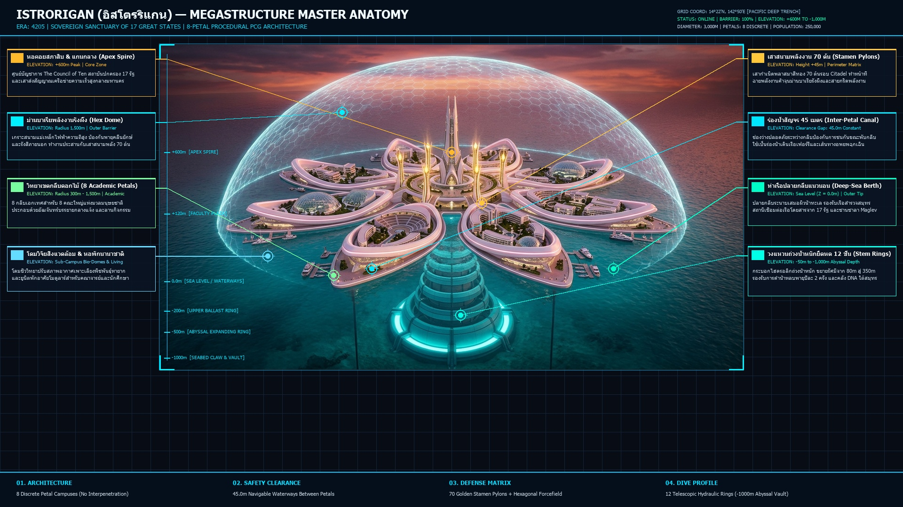
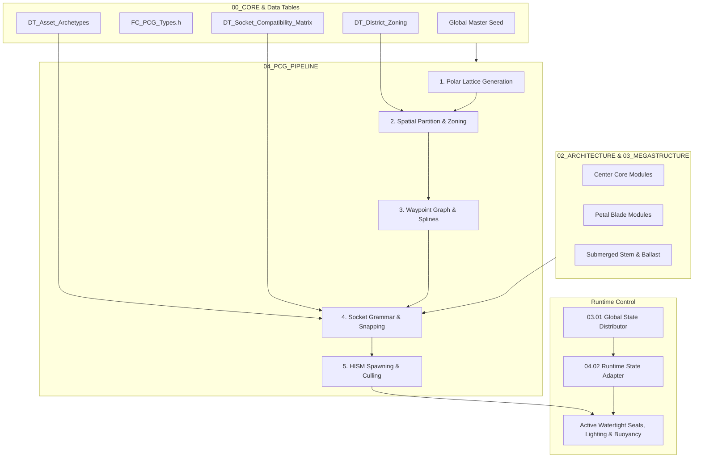

# ISTRORIGAN (FLOWER CITY) - PCG Architecture & World Specification

> **Era: 4205 | World of 17 Great States**  
> มหานครดอกบัวต้นแบบแห่งการศึกษาและภูมิปัญญาสูงสุดของมนุษยชาติ **"ISTRORIGAN" (อิสโตรริแกน)**  
> ศูนย์รวมมหาวิทยาลัยชั้นนำและทุกศาสตร์บนโลก ปกครองโดย **สภาสูง 10 คน (The Council of Ten)** ณ หอคอยแกนกลาง และ **สภาย่อย** ประจำทั้ง 8 กลีบวิทยาเขต  
> ออกแบบสถาปัตยกรรมและ Data Contracts สำหรับระบบ **Procedural Content Generation (PCG)** ใน Unreal Engine 5 / Houdini



> 📘 **ผังโครงสร้างสถาปัตยกรรมไฟนอลแบบละเอียด**: ดูคำอธิบายระบบทั้ง 8 พาร์ทอย่างละเอียดได้ที่ [08_PRESENTATION/08_FINAL_MASTER_BREAKDOWN.md](08_PRESENTATION/08_FINAL_MASTER_BREAKDOWN.md)

---

## สารบัญโครงสร้างเอกสาร (Documentation Directory)

```
<project>/
├── README.md                                  # สารบัญหลักและคำแนะนำการติดตั้ง PCG
├── 00_CORE/
│   ├── FC_PCG_Types.h                         # [C++ Header] USTRUCTs, UENUMs & FTableRowBase
│   ├── 00_CORE_SETTINGS.md                    # การตั้งค่าสเกล เมล็ดพันธุ์ (Seed) และคลังแอตทริบิวต์
│   ├── 00_PCG_DATA_CONTRACTS.md               # [Data Contracts] Radial Math, Sockets & Rules
│   └── DATA_TABLES/
│       ├── 01_DATA_TABLE_DISTRICT_ZONING.md   # [DataTable] ตาราง Zoning, รัศมี & แรงลอยตัว (+JSON)
│       ├── 02_DATA_TABLE_ASSET_ARCHETYPES.md  # [DataTable] แคตตาล็อกโมดูล 21 ชิ้นส่วน (+JSON)
│       └── 03_DATA_TABLE_SOCKET_MATRIX.md     # [DataTable] กติกาการ Snap และ Clearance Box (+JSON)
├── 01_WORLD/
│   ├── 01_WORLD_AND_ZONING.md                 # การแบ่งโซนเมืองและแปลงที่ดิน (Zoning & Plots)
│   └── 02_RADIAL_GRID_MATH.md                 # [Math] สูตรคณิตศาสตร์ Polar Math & Petal UV (VEX/BP)
├── 02_ARCHITECTURE/
│   └── 02_MODULAR_ASSEMBLY.md                 # กฎการประกอบชิ้นส่วนสถาปัตยกรรม (Kit-of-Parts)
├── 03_MEGASTRUCTURE/
│   ├── 03_01_GLOBAL_STATE.md                  # State Machine สากล (Bloom, Submerge, Emergency)
│   ├── 03_02_CENTER_CORE/                     # แกนกลางเมือง (Center Hub)
│   │   ├── 01_CENTER_STRUCTURE_GEOMETRY.md    # โครงสร้าง รูปทรงโคน และข้อจำกัดความสูง
│   │   ├── 02_CENTER_TRANSPORT_CIRCULATION.md # โครงข่ายขนส่ง ทางเดิน และลิฟต์แนวดิ่ง
│   │   ├── 03_CENTER_SERVICE_UTILITY.md       # ท่อส่งพลังงาน ออกซิเจน และห้องเครื่องกล
│   │   ├── 04_CENTER_PROTECTION_NETWORK.md    # โครงข่ายเสาสนามพลังและม่านป้องกัน
│   │   ├── 05_CENTER_STATE_MACHINE.md         # State Machine ประจำแกนกลาง
│   │   ├── 06_CENTER_SOCKETS.md               # จุดเชื่อมต่อทางกายภาพ (Hardware Sockets)
│   │   └── 07_CENTER_COUPLING_INTERFACES.md   # รอยต่อระหว่าง Center-to-Petal และ Center-to-Stem
│   ├── 03_03_PETAL_SYSTEM.md                  # โครงสร้างกลีบเมือง สถานะ และข้อต่อ Rig
│   ├── 03_04_ZONES_AND_SCATTER.md             # กฎการ Scatter จุดและแนวชายฝั่งรอบกลีบ
│   ├── 03_05_STEM_AND_ROOT.md                 # ลำต้นใต้น้ำ เสายืดหด และรากยึดพื้นสมุทร
│   ├── 03_06_PROTECTION_AND_CLEARANCE.md      # ระยะปลอดภัยและม่านพลังรอบนอก
│   ├── 03_07_STATE_DEPENDENCY.md              # ตารางเงื่อนไขความสัมพันธ์ของสถานะ
│   └── 03_08_RIG_EXPORT_INTERFACE.md          # ส่วนต่อประสานกระดูกและการส่งออก Rig
├── 04_PCG_PIPELINE/
│   ├── 01_PCG_GENERATION_PIPELINE.md          # ขั้นตอนการ Generate โลก 5 ขั้น (5-Stage Graph)
│   ├── 02_PCG_RUNTIME_STATE_ADAPTER.md        # การเชื่อมต่อ State เข้ากับโมดูลที่ถูกวาง
│   ├── 03_TRANSIT_AND_RESOURCE_GRAPH.md       # [Graph] โครงข่าย Maglev, ท่อ O2, และเส้นทางอพยพ
│   └── 04_UE5_PCG_GRAPH_SETUP_GUIDE.md        # [UE5 Setup] คู่มือประกอบโหนดใน Unreal Engine 5 PCG
├── 05_SCIFI_AND_PROPS/
│   └── 05_SCIFI_AND_PROPS.md                  # คลังสายไฟ ท่อ แสงไฟ และพร็อพตกแต่ง
├── 06_GAME_READY/
│   └── 06_GAME_READY_TECH.md                  # LODs, Nanite, Collisions, และ Material IDs
└── 08_PRESENTATION/
    ├── 08_FINAL_MASTER_BREAKDOWN.md           # [Master Infographic] ผังวิเคราะห์สถาปัตยกรรมและ 8 ระบบหลัก
    ├── 09_PARTS_VISUAL_BREAKDOWN.md           # [Part Visuals] ภาพประกอบ Render แยก 9 ชิ้นส่วนหลัก
    ├── 10_HOUDINI_PRODUCTION_GUIDE.md         # [Houdini Guide] คู่มือขึ้นโปรเจกต์ 9 พาร์ทใน Houdini
    └── parts/                                 # [Image Assets] คลังรูปภาพ Render 8K แต่ละส่วนโครงสร้าง
```

---

## ภาพรวมสถาปัตยกรรมระบบ PCG (PCG System Architecture)



---

## คู่มือเริ่มต้นสำหรับ Developer (Quick Start)
1. **ติดตั้ง C++ Header**: นำ [FC_PCG_Types.h](00_CORE/FC_PCG_Types.h) ไปใส่ในโฟลเดอร์ `Source/<Project>/Public/PCG/` ในโปรเจกต์ Unreal Engine ของคุณ
2. **Import Data Tables**: ก๊อบปี้โค้ด JSON จาก [01_DATA_TABLE_DISTRICT_ZONING.md](00_CORE/DATA_TABLES/01_DATA_TABLE_DISTRICT_ZONING.md), [02_DATA_TABLE_ASSET_ARCHETYPES.md](00_CORE/DATA_TABLES/02_DATA_TABLE_ASSET_ARCHETYPES.md), และ [03_DATA_TABLE_SOCKET_MATRIX.md](00_CORE/DATA_TABLES/03_DATA_TABLE_SOCKET_MATRIX.md) เข้า Content Browser
3. **ศึกษาการคำนวณพิกัดกลีบดอกไม้**: อ่านสูตรคณิตศาสตร์และโค้ด VEX/Blueprint ได้ที่ [02_RADIAL_GRID_MATH.md](01_WORLD/02_RADIAL_GRID_MATH.md)
4. **ประกอบ PCG Graph ใน UE5**: ทำตามขั้นตอนทีละโหนดใน [04_UE5_PCG_GRAPH_SETUP_GUIDE.md](04_PCG_PIPELINE/04_UE5_PCG_GRAPH_SETUP_GUIDE.md)
5. **ต่อระบบโครงข่ายเกมเพลย์ & State Adapter**: ดูการวางระบบ Maglev, ท่อ O2, และระบบตัดตอนน้ำท่วมได้ที่ [03_TRANSIT_AND_RESOURCE_GRAPH.md](04_PCG_PIPELINE/03_TRANSIT_AND_RESOURCE_GRAPH.md) และ [02_PCG_RUNTIME_STATE_ADAPTER.md](04_PCG_PIPELINE/02_PCG_RUNTIME_STATE_ADAPTER.md)
