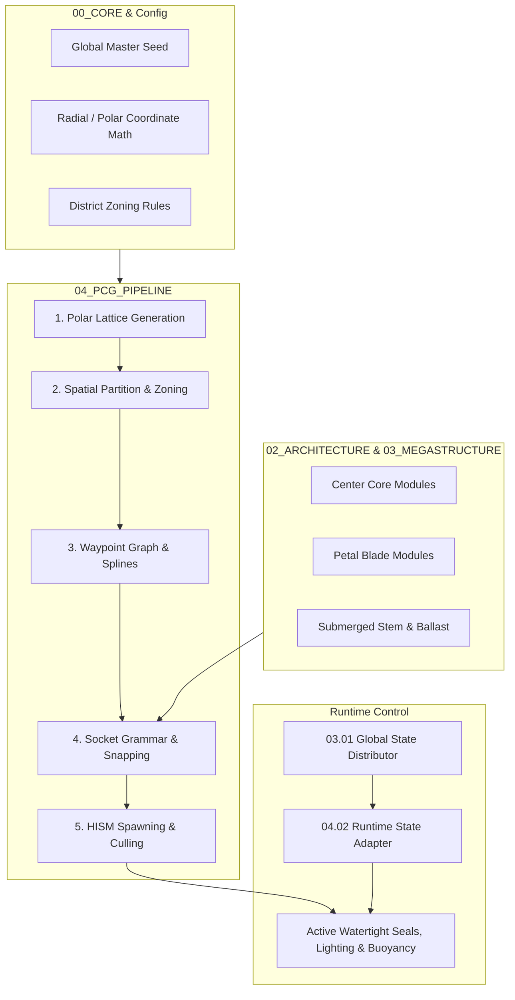

# FLOWER CITY - PCG Architecture & Master Specification

> เอกสารสถาปัตยกรรมและ Data Contracts สำหรับการสร้างเมืองดอกไม้มหึมา (Megastructure) ด้วยระบบ **Procedural Content Generation (PCG)** ใน Unreal Engine 5 / Houdini

---

## สารบัญโครงสร้างเอกสาร (Documentation Directory)

```
d:/2/OWN/HOPELESS/
├── README.md                                  # สารบัญหลักและคำแนะนำการติดตั้ง PCG
├── 00_CORE/
│   ├── 00_CORE_SETTINGS.md                    # การตั้งค่าสเกล เมล็ดพันธุ์ (Seed) และคลังแอตทริบิวต์
│   └── 00_PCG_DATA_CONTRACTS.md               # [สำคัญ] Data Structs, Radial Math, Sockets & Rules
├── 01_WORLD/
│   └── 01_WORLD_AND_ZONING.md                 # การแบ่งโซนเมืองและแปลงที่ดิน (Zoning & Plots)
├── 02_ARCHITECTURE/
│   └── 02_MODULAR_ASSEMBLY.md                 # กฎการประกอบชิ้นส่วนสถาปัตยกรรม (Kit-of-Parts)
├── 03_MEGASTRUCTURE/
│   ├── 03_01_GLOBAL_STATE.md                  # State Machine สากล (Bloom, Submerge, Emergency)
│   ├── 03_02_CENTER_CORE/                     # แกนกลางเมือง (Center Hub)
│   │   ├── 01_CENTER_STRUCTURE_GEOMETRY.md    # โครงสร้าง รูปทรงโคน และข้อจำกัดความสูง
│   │   ├── 02_CENTER_TRANSPORT_CIRCULATION.md # โครงข่ายขนส่ง ทางเดิน และลิฟต์แนวดิ่ง
│   │   ├── 03_CENTER_SERVICE_UTILITY.md       # ท่อส่งพลังงาน ออกซิเจน และห้องเครื่องกล
│   │   ├── 04_CENTER_PROTECTION_NETWORK.md    # โครงข่ายเสาสนามพลังและม่านป้องกัน
│   │   ├── 05_CENTER_STATE_MACHINE.md         # State Machine ประจำแกนกลาง
│   │   ├── 06_CENTER_SOCKETS.md               # จุดเชื่อมต่อทางกายภาพ (Hardware Sockets)
│   │   └── 07_CENTER_COUPLING_INTERFACES.md   # รอยต่อระหว่าง Center-to-Petal และ Center-to-Stem
│   ├── 03_03_PETAL_SYSTEM.md                  # โครงสร้างกลีบเมือง สถานะ และข้อต่อ Rig
│   ├── 03_04_ZONES_AND_SCATTER.md             # กฎการ Scatter จุดและแนวชายฝั่งรอบกลีบ
│   ├── 03_05_STEM_AND_ROOT.md                 # ลำต้นใต้น้ำ เสายืดหด และรากยึดพื้นสมุทร
│   ├── 03_06_PROTECTION_AND_CLEARANCE.md      # ระยะปลอดภัยและม่านพลังรอบนอก
│   ├── 03_07_STATE_DEPENDENCY.md              # ตารางเงื่อนไขความสัมพันธ์ของสถานะ
│   └── 03_08_RIG_EXPORT_INTERFACE.md          # ส่วนต่อประสานกระดูกและการส่งออก Rig
├── 04_PCG_PIPELINE/
│   ├── 01_PCG_GENERATION_PIPELINE.md          # ขั้นตอนการ Generate โลก 5 ขั้น (5-Stage Graph)
│   └── 02_PCG_RUNTIME_STATE_ADAPTER.md        # การเชื่อมต่อ State เข้ากับโมดูลที่ถูกวาง
├── 05_SCIFI_AND_PROPS/
│   └── 05_SCIFI_AND_PROPS.md                  # คลังสายไฟ ท่อ แสงไฟ และพร็อพตกแต่ง
└── 06_GAME_READY/
    └── 06_GAME_READY_TECH.md                  # LODs, Nanite, Collisions, และ Material IDs
```

---

## ภาพรวมสถาปัตยกรรมระบบ PCG (PCG System Architecture)



---

## คู่มือเริ่มต้นสำหรับ Developer (Quick Start)
1. **ศึกษาพิกัดและ Structs พื้นฐาน**: อ่าน [00_PCG_DATA_CONTRACTS.md](file:///d:/2/OWN/HOPELESS/00_CORE/00_PCG_DATA_CONTRACTS.md) เพื่อทำความเข้าใจ `FFC_RadialCoordinates`, `FFC_PCG_Socket`, และ `FFC_ModuleSpawnRule`
2. **เข้าใจการสร้างเมือง 5 สเต็ป**: อ่าน [01_PCG_GENERATION_PIPELINE.md](file:///d:/2/OWN/HOPELESS/04_PCG_PIPELINE/01_PCG_GENERATION_PIPELINE.md) สำหรับการสร้าง Node ใน UE5 PCG Graph
3. **ตรวจสอบกติกาข้อต่อและรูปทรง**: ตรวจสอบ [01_CENTER_STRUCTURE_GEOMETRY.md](file:///d:/2/OWN/HOPELESS/03_MEGASTRUCTURE/03_02_CENTER_CORE/01_CENTER_STRUCTURE_GEOMETRY.md) และ [06_CENTER_SOCKETS.md](file:///d:/2/OWN/HOPELESS/03_MEGASTRUCTURE/03_02_CENTER_CORE/06_CENTER_SOCKETS.md)
4. **เชื่อมต่อ State Machine**: ดูวิธีควบคุมโมดูลตอนดำน้ำหรือเกิดเหตุฉุกเฉินที่ [02_PCG_RUNTIME_STATE_ADAPTER.md](file:///d:/2/OWN/HOPELESS/04_PCG_PIPELINE/02_PCG_RUNTIME_STATE_ADAPTER.md)
